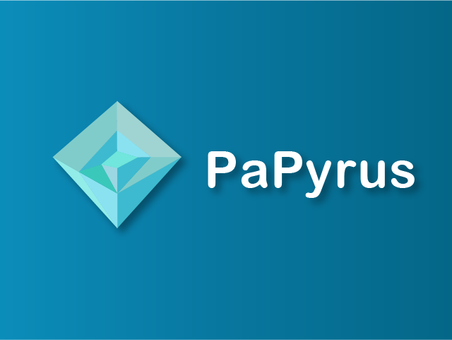
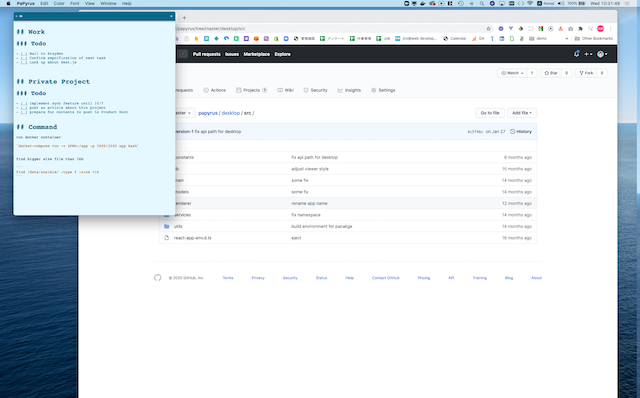
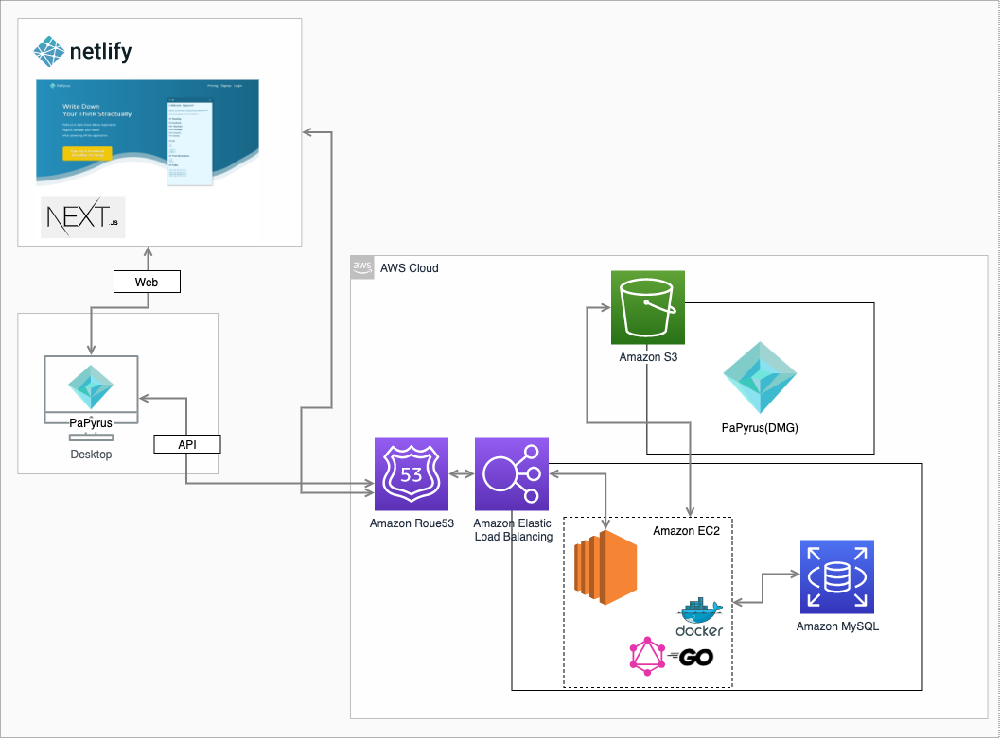

:warning: Development Halt :warning:

 This repository is a document repository for PaPyrus

# PaPyrus

You can check this product for a following link

[https://papyrus-app.org/](https://papyrus-app.org/)

## About

### Overview

PaPyrus is a memo application like sticky note. It makes your work boost by just putting it on desktop.
It is easy to use and you don't need to think about many things which general memo apps has such as category, tag, title and so on.

You can use this app as if it is Snapchat or Story on Instagram.

### Why I made

There are a lot of awesome memo applications in the world but I didn't satisfy those applications because
My almost notes are likely to be short-lived and not to be reviewed again.
Almost applications have too many features to match with this useage.

That is why I had been wanting a application managing short-lived memos and made it.

I hope that you like this app and frendly feedback.

## Technology

Now I am looking for a full-time job.
That is why ,to prove my technology skill and interest, I will explain about the architecture of this app.
I love to develop a interesitng and good product to move users so prefer to design from end to end and develop.
If you are interested in me, please contact bellow.

Email: j.code.public@gmail.com

<table>
 <thead>
  <tr>
   <th>Web</th>
   <th>Desktop</th>
   <th>API</th>
  </tr>
 </thead>
 <tbody>
  <tr>
   <td>
      <ul>
       <li>React</li>
       <li>Redux</li>
       <li>Redux Thunk</li>
       <li>Next.js</li>
       <li>Immutable.js</li>
       <li>Styled Components</li>
       <li>TypeScript</li>
       <li>Apollo Client</li>
       <li>Ant Design(for console)</li>
       <li>Eslint+Prettier</li>
       <li>Formik</li>
      </ul>
   </td>
   <td>
    　<ul>
        <li>React</li>
        <li>Redux Thunk</li>
        <li>Electron</li>
        <li>Apollo Client</li>
        <li>Code Mirror</li>
        <li>TypeScript</li>
        <li>Nedb</li>
        <li>Formik</li>
        <li>Eslint+Prettier</li>
     </ul>
   </td>
   <td>
     <ul>
      <li>Gin(Golang)</li>
      <li>Gorm(MySQL))</li>
      <li>GraphQL(gqlgen)</li>
      <li>Docker</li>
      <li>AWS ELB</li>
      <li>AWS EC2</li>
      <li>Sendgrid</li>
     </ul>
   </td>
  </tr>
 </tbody>
</table>

## Features

<ul>
 <li>Write and edit with markdown</li>
 <li>Preview content written by markdowny</li>
 <li>Multi Screeny</li>
 <li>Persistent Datay</li>
 <li>Adjust font size and font familly</li>
 <li>Change Color Theme</li>
</ul>

### Upcoming

- [ ] Sync data remotely between devices you login
- [ ] Change color theme
- [ ] Customize memo appearance

